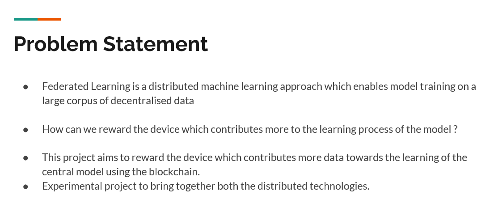
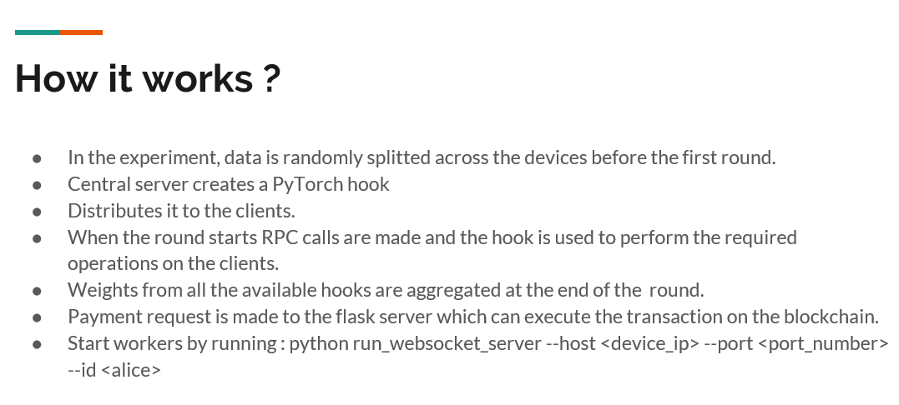

# distributed_systems_project
Bounty based federated learning in Deep Neural Networks.

Abstract—The goal of the project is to address two of the major problems in the machine learning field. One is the privacy and availability of the data and the other is compute power required for the training of models.Federated Machine Learning (FML) enables multiple parties to collaborate on building models while protecting data privacy for the participants. A measure of the contribution for each party in FML enables fair credits allocation. In this paper we study the advantages of FML over standard machine learning, explore the feasibility of rewarding the users participating in the learning process of the model using block chain by building a proof of concept(PoC) and propose a sustainable and scalable architecture from the findings of the PoC.

Detailed project report [link](https://github.com/prashanth-thipparthi/distributed_systems_project/blob/master/Final%20Project%20Report.pdf "Title").

Video presentation [link](https://github.com/prashanth-thipparthi/distributed_systems_assignment1/blob/master/ProgrammingAssignment1.pdf "Title").

Detailed presentation [link](https://github.com/prashanth-thipparthi/distributed_systems_project/blob/master/Bounty%20Based%20Federated%20Learning%20of%20Neural%20Networks.pptx "Title").

## Details

